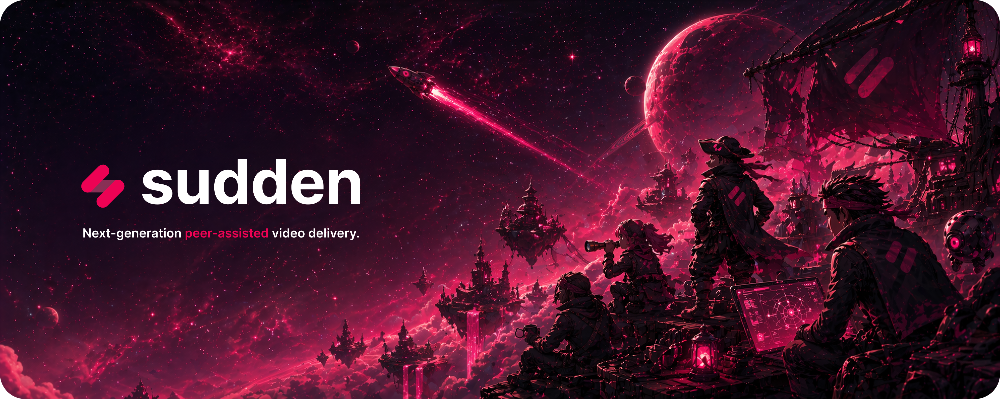

Sudden is building the next generation of peer-assisted video delivery for media, entertainment, sports, and gaming companies. We help reduce video delivery costs with software that works alongside your existing delivery infrastructure.

This GitHub organization is where we share our public code, tools, and developer resources.

## Install the Skill

Give your AI assistant deep knowledge of Sudden integrations, configuration, and implementation patterns:

```sh
npx skills add sudden-network/skills
```

This installs the Sudden skill into your project. Once installed, your AI assistant automatically loads it when working on Sudden integrations.

## Documentation

- Getting started: https://docs.sudden.network/getting-started/
- JavaScript client: https://docs.sudden.network/javascript-client/
- React client: https://docs.sudden.network/react-client/
